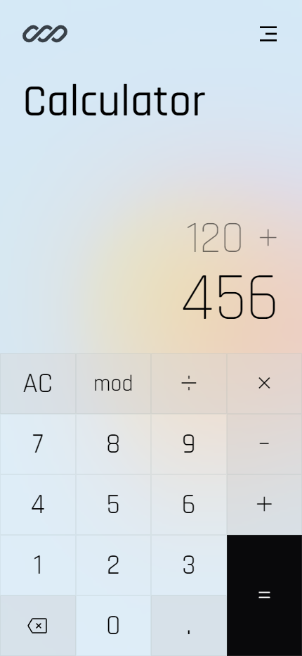
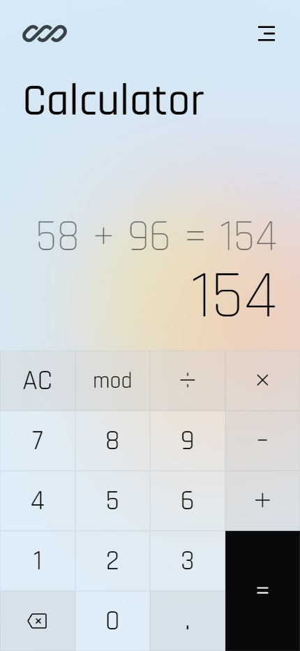
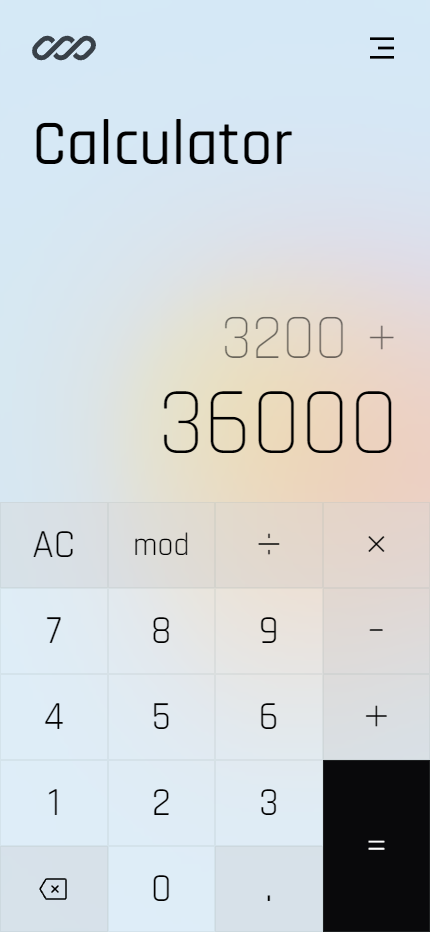

# 

 
 

This project is part of The Odin Project's Foundations Course, where I built an on-screen calculator using JavaScript, HTML, and CSS. The challenge required combining all the knowledge gathered throughout the course, particularly focusing on JavaScript logic to handle arithmetic operations and user input. This project deepened my understanding of building interactive features and processing user inputs efficiently, while also improving the modularity of my JavaScript code.

 Screenshots

  
    

    
&nbsp;
    
&nbsp;
    

## 📝 Project Objective

The goal of this project was to create a fully functional calculator that supports basic arithmetic operations (addition, subtraction, multiplication, division) and additional features like modulo. The calculator allows for a seamless user experience by preventing errors like dividing by zero, updating the display dynamically, and supporting chained operations.

## 🔧 Features

- **Basic Arithmetic Operations**: Supports addition, subtraction, multiplication, division, and modulo.

- **User Input via Buttons**: Users can click number and operator buttons for input, with the display updating dynamically.

- **Continuous Calculations**: The calculator evaluates operations step by step, allowing users to chain multiple operations.

- **Error Handling**: Displays an error message when attempting to divide by zero.

- **Clear and Delete Functions**: Includes a clear button to reset the calculator and a delete button to remove the last input.

## 📖 Learnings

- **DOM Manipulation**: Improved my skills in dynamically creating and updating UI elements through JavaScript.

- **Event Listeners**: Enhanced my understanding of adding interactive behaviors, like button clicks, and linking them to JavaScript functions.

- **Modular JavaScript**: Implemented a clean structure for managing calculator operations using separate functions for each arithmetic operation.

- **CSS Styling**: Practiced responsive styling to ensure the calculator layout worked across various screen sizes.

- **User Error Handling**: Handled cases such as dividing by zero and invalid inputs to provide a smooth user experience.

## 💻 Technologies Used

- **HTML5** for structuring the application and creating the layout of the calculator.

- **CSS3** for styling the calculator interface, including responsive design and visual feedback.

- **JavaScript** for implementing the core functionality, including handling user inputs, performing calculations, and managing application state.

## 💡 Acknowledgments

- **The Odin Project**: For providing the project outline and guidance.

- Special thanks to <a href="https://unsplash.com/pt-br/@mymind">mymind</a> for providing the <a href="https://unsplash.com/pt-br/fotografias/sol-no-ceu-durante-o-dia-XUlsF9LYeVk?utm_content=creditCopyText&utm_medium=referral&utm_source=unsplash">background image</a> used in this project.

- Logo provided by <a href="https://logoipsum.com/">Logo Ipsum</a>.
